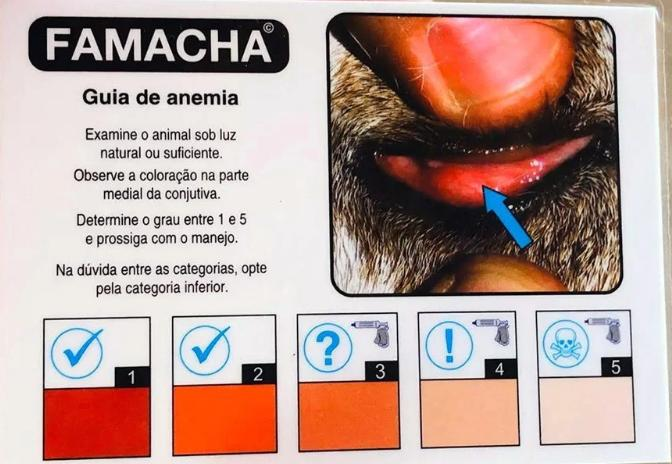

# IC UFPI 2023 -> 2024

## Pesquisa em Iniciação Científica em Visão Computacional para Classificação de Caprinos e Ovinos

Minha pesquisa concentra-se na aplicação da visão computacional para classificar imagens de caprinos e ovinos, com o propósito de identificar precisamente a necessidade de vermifugação de acordo com o sistema FAMACHA.

Meu objetivo neste projeto é automatizar e aprimorar o processo de identificação do grau FAMACHA em animais, contribuindo para um manejo mais eficaz da saúde desses animais na pecuária. Se você estiver interessado em visão computacional, classificação de imagens ou pecuária, convido você a explorar meus repositórios e projetos relacionados a esta pesquisa. Estou aberto a colaborações e discussões nessa área e espero contribuir para o avanço do conhecimento neste campo.

A baixo estão algumas das principais dúvidas sobre o assunto caso você desconheça o tema da minha pesquisa.

## FAMACHA

O FAMACHA© é o método mais indicado para o controle seletivo em regiões onde o verme predominante é Haemonchus contortus, pois ao se alimentar do sangue dos animais, causa diferentes graus de anemia que podem ser classificados com auxílio de um cartão colorido.

Os cinco graus de coloração no cartão direcionam a vermifugação dos animais onde os graus 1 e 2 são de animais com coloração vermelho vivo, ou seja, sem traços de anemia. A partir do grau 3, já é indicada a vermifugação,que é imprescindível nos graus 4 e 5. Porém, quando a mucosa apresenta palidez intensa (grau 5) é recomendável que o animal tenha suporte com alimentação reforçada em proteínas (volumosa ou concentrada), ferro oral ou injetável e suplementos a base de aminoácidos, conforme a indicação da bula. Havendo condições (infraestrutura/Veterinários) a transfusão de sangue é recomendada. Animais com grau de anemia 5, só devem ser vermifugados quando o quadro de anemia estiver amenizado. Veja a imagem a baixo para entender mais sobre as cores e o cartão.


<!-- 
 -->

<p align="center">
  
</p>


Fonte: https://www.embrapa.br/paratec-controle-integrado-verminoses/vermes/caprinos-ovinos/famacha

## Como usar o projeto (Linux)
Crie um ambiente virutal para instalar as dependencias necessárias para executar e o ative
```bash
python3 -m venv venv
source venv/bin/activate
```


Instale as dependencias no seu ambiente
```bash
pip install -r requirements.txt
source venv/bin/activate
```

## Dependencias do SO (Recomendo usar Ubuntu)
```bash
sudo apt update
sudo apt install libgl1-mesa-glx ffmpeg libsm6 libxext6  -y
```